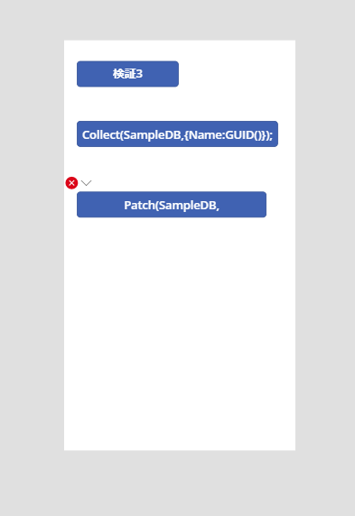

#  概要

Power Apps のキャンバスアプリのでデータソースに対してデータを追加する時には Patch 関数と Collect 関数が使えます。このどちらを使えばいいのかを今回は解説します。
また、この情報は 2021/05/10 時点の日本環境でのものとなります。

# Collect 関数とは

こちらの記事をご参照ください
[Power Apps Collect 関数の使い方と解説](https://www.powerplatform.work/blog/2021/05/10/PowerApps%E9%96%A2%E6%95%B0%E8%A7%A3%E8%AA%ACCollect/)

# Patch 関数とは

公式より

```
Collect 関数は、データ ソース 内で 1 つ以上の レコード を変更または作成するか、データ ソースの外部でレコードをマージします。
```

# 検証

この２つの関数を Dataverse をデータソースとして検証していきましょう

## データを追加する

```
Patch(SampleDB,Defaults(SampleDB),{Name:GUID()});
Collect(SampleDB,{Name:GUID()});
```

２度実行したので、４件登録されていますが、データソース上に違いはありません。

<a class="post-image" href="/assets/blogpost/2021/2021-05-10-07-54-27.png">

</a>

では通信はどのようになっているでしょうか？
もう一度実行してみましょう。

<a class="post-image" href="/assets/blogpost/2021/2021-05-10-07-57-05.png">

</a>

ID2 が Patch 関数で ID6 が Collect 関数によるデータ追加です。
どちらも同じように見えますが、実は通信している詳細なデータは異なります。

Patch 関数

```
{
  "status": 201,
  "duration": 195.81,
  "dataSource": "SampleDB",
  "responseSize": 2068,
  "controlName": "Button1_3",
  "propertyName": "OnSelect",
  "nodeId": 8,
  "formulaData": {
    "script": "Patch(SampleDB,Defaults(SampleDB),{Name:GUID()})",
    "spanStart": 0,
    "spanEnd": 48
  },
  "data": {
    "context": {
      "entityName": "Button1_3",
      "propertyName": "OnSelect",
      "id": 26,
      "nodeId": 8,
      "diagnosticContext": {
        "dataOperation": {
          "protocol": "cds",
          "operation": "createRow",
          "dataSource": "SampleDB",
          "apiId": "CdsNative",
          "table": "cr211_sampledbs",
          "operationName": "CdsConnector.createRowAsync"
        },
        "formula": "Patch(SampleDB,Defaults(SampleDB),{Name:GUID()})",
        "span": {
          "start": 0,
          "end": 48
        }
      }
    },
    "request": {
      "url": "https://crm7.dynamics.com/api/data/v9.0/cr211_sampledbs",
      "method": "POST",
      "headers": {
        "Accept": "application/json",
        "Prefer": "odata.continue-on-error",
        "x-ms-user-agent": "PowerApps/3.21044.25 (Web AuthoringTool; AppName=<NonCloudApp>)",
        "Accept-Language": "ja",
        "Cache-Control": "no-cache, no-store"
      },
      "body": {
        "cr211_name": "a935a003-2723-4f15-9206-0274e0d90f90"
      }
    },
    "response": {
      "duration": 195.81,
      "size": 2068,
      "status": 201,
      "headers": {
        "Preference-Applied": "odata.include-annotations=\"*\"",
        "Content-Type": "application/json; odata.metadata=minimal",
        "OData-Version": 4,
        "Cache-Control": "no-cache",
        "content-encoding": "gzip",
        "Content-Length": 797,
        "expires": -1,
        "odata-version": 4
      },
      "body": {
        割愛
      },
      "responseType": "json"
    },
    "startTime": 1838892.93,
    "name": "https://crm7.dynamics.com/api/data/v9.0/$batch",
    "fetchStart": 1838892.93,
    "domainLookupStart": 1838893.67,
    "domainLookupEnd": 1838893.68,
    "connectStart": 1838893.68,
    "connectEnd": 1838945.36,
    "secureConnectionStart": 1838921.9,
    "requestStart": 1838946.34,
    "responseStart": 1839079.08,
    "responseEnd": 1839079.36,
    "transferSize": 1950,
    "nextHopProtocol": "h2"
  }
}
```

Collect 関数

```
{
  "status": 201,
  "duration": 177.93,
  "dataSource": "SampleDB",
  "responseSize": 2068,
  "controlName": null,
  "propertyName": null,
  "nodeId": null,
  "formulaData": {
    "script": "",
    "spanStart": null,
    "spanEnd": null
  },
  "data": {
    "context": {
      "diagnosticContext": {
        "dataOperation": {
          "protocol": "cds",
          "operation": "createRow",
          "dataSource": "SampleDB",
          "apiId": "CdsNative",
          "table": "cr211_sampledbs",
          "operationName": "CdsConnector.createRowAsync"
        }
      }
    },
    "request": {
      "url": "https://crm7.dynamics.com/api/data/v9.0/cr211_sampledbs",
      "method": "POST",
      "headers": {
        "Accept": "application/json",
        "Prefer": "odata.continue-on-error",
        "x-ms-user-agent": "PowerApps/3.21044.25 (Web AuthoringTool; AppName=<NonCloudApp>)",
        "Accept-Language": "ja",
        "Cache-Control": "no-cache, no-store"
      },
      "body": {
        "cr211_name": "67acf94c-3e22-4633-8957-b2e2ed4aa62d"
      }
    },
    "response": {
      "duration": 177.93,
      "size": 2068,
      "status": 201,
      "headers": {
        "Preference-Applied": "odata.include-annotations=\"*\"",
        "Content-Type": "application/json; odata.metadata=minimal",
        "OData-Version": 4,
        "Cache-Control": "no-cache",
        "content-encoding": "gzip",
        "Content-Length": 796,
        "expires": -1,
        "odata-version": 4
      },
      "body": {
        割愛
      },
      "responseType": "json"
    },
    "startTime": 1842635.56,
    "name": "https://crm7.dynamics.com/api/data/v9.0/$batch",
    "fetchStart": 1842635.56,
    "domainLookupStart": 1842635.56,
    "domainLookupEnd": 1842635.56,
    "connectStart": 1842635.56,
    "connectEnd": 1842635.56,
    "secureConnectionStart": 1842635.56,
    "requestStart": 1842636.29,
    "responseStart": 1842809.78,
    "responseEnd": 1842810.04,
    "transferSize": 1219,
    "nextHopProtocol": "h2"
  }
}
```

ここからわかることとして以下の違いがあります。

- どちらも CdsConnectorの createRowAsync を用いて実行している。
- Collect で行った場合は formula(式) がデータ上からはわからない。
- 通信のサイズは同じ(1行の場合)
- 実行時間は誤差だが検証した環境では Collect のほうが早い(1行のデータ追加のみの場合)


ここで実行時間についてですが、注目してもらいたいのは、 ID 4 になります。
Collect を実行した際に、CdsConnector.getRowsAsync を呼び出しています。Collect は データソースを指定している場合、関数実行時に毎回データソースを確認しに行っていることがわかります。


## 検証2 実行速度

1 行では誤差程度でしたが、今度は 100 レコード追加してみます。
まずは Patch 関数から

以下の式で 10回ほど試しましたが、一度も成功しませんでした。

```
Patch(SampleDB,Table({Name:GUID(),sample:"test"},{Name:GUID(),sample:"test"},{Name:GUID(),sample:"test"},{Name:GUID(),sample:"test"},{Name:GUID(),sample:"test"},{Name:GUID(),sample:"test"},{Name:GUID(),sample:"test"},{Name:GUID(),sample:"test"},{Name:GUID(),sample:"test"},{Name:GUID(),sample:"test"},{Name:GUID(),sample:"test"},{Name:GUID(),sample:"test"},{Name:GUID(),sample:"test"},{Name:GUID(),sample:"test"},{Name:GUID(),sample:"test"},{Name:GUID(),sample:"test"},{Name:GUID(),sample:"test"},{Name:GUID(),sample:"test"},{Name:GUID(),sample:"test"},{Name:GUID(),sample:"test"},{Name:GUID(),sample:"test"},{Name:GUID(),sample:"test"},{Name:GUID(),sample:"test"},{Name:GUID(),sample:"test"},{Name:GUID(),sample:"test"},{Name:GUID(),sample:"test"},{Name:GUID(),sample:"test"},{Name:GUID(),sample:"test"},{Name:GUID(),sample:"test"},{Name:GUID(),sample:"test"},{Name:GUID(),sample:"test"},{Name:GUID(),sample:"test"},{Name:GUID(),sample:"test"},{Name:GUID(),sample:"test"},{Name:GUID(),sample:"test"},{Name:GUID(),sample:"test"},{Name:GUID(),sample:"test"},{Name:GUID(),sample:"test"},{Name:GUID(),sample:"test"},{Name:GUID(),sample:"test"},{Name:GUID(),sample:"test"},{Name:GUID(),sample:"test"},{Name:GUID(),sample:"test"},{Name:GUID(),sample:"test"},{Name:GUID(),sample:"test"},{Name:GUID(),sample:"test"},{Name:GUID(),sample:"test"},{Name:GUID(),sample:"test"},{Name:GUID(),sample:"test"},{Name:GUID(),sample:"test"},{Name:GUID(),sample:"test"},{Name:GUID(),sample:"test"},{Name:GUID(),sample:"test"},{Name:GUID(),sample:"test"},{Name:GUID(),sample:"test"},{Name:GUID(),sample:"test"},{Name:GUID(),sample:"test"},{Name:GUID(),sample:"test"},{Name:GUID(),sample:"test"},{Name:GUID(),sample:"test"},{Name:GUID(),sample:"test"},{Name:GUID(),sample:"test"},{Name:GUID(),sample:"test"},{Name:GUID(),sample:"test"},{Name:GUID(),sample:"test"},{Name:GUID(),sample:"test"},{Name:GUID(),sample:"test"},{Name:GUID(),sample:"test"},{Name:GUID(),sample:"test"},{Name:GUID(),sample:"test"},{Name:GUID(),sample:"test"},{Name:GUID(),sample:"test"},{Name:GUID(),sample:"test"},{Name:GUID(),sample:"test"},{Name:GUID(),sample:"test"},{Name:GUID(),sample:"test"},{Name:GUID(),sample:"test"},{Name:GUID(),sample:"test"},{Name:GUID(),sample:"test"},{Name:GUID(),sample:"test"},{Name:GUID(),sample:"test"},{Name:GUID(),sample:"test"},{Name:GUID(),sample:"test"},{Name:GUID(),sample:"test"},{Name:GUID(),sample:"test"},{Name:GUID(),sample:"test"},{Name:GUID(),sample:"test"},{Name:GUID(),sample:"test"},{Name:GUID(),sample:"test"},{Name:GUID(),sample:"test"},{Name:GUID(),sample:"test"},{Name:GUID(),sample:"test"},{Name:GUID(),sample:"test"},{Name:GUID(),sample:"test"},{Name:GUID(),sample:"test"},{Name:GUID(),sample:"test"},{Name:GUID(),sample:"test"},{Name:GUID(),sample:"test"},{Name:GUID(),sample:"test"},{Name:GUID(),sample:"test"}))
```

よくある ForAll + Patch も使って検証してみましょう。

```
Collect(sCol,{Name:GUID(),sample:"test"},{Name:GUID(),sample:"test"},{Name:GUID(),sample:"test"},{Name:GUID(),sample:"test"},{Name:GUID(),sample:"test"},{Name:GUID(),sample:"test"},{Name:GUID(),sample:"test"},{Name:GUID(),sample:"test"},{Name:GUID(),sample:"test"},{Name:GUID(),sample:"test"},{Name:GUID(),sample:"test"},{Name:GUID(),sample:"test"},{Name:GUID(),sample:"test"},{Name:GUID(),sample:"test"},{Name:GUID(),sample:"test"},{Name:GUID(),sample:"test"},{Name:GUID(),sample:"test"},{Name:GUID(),sample:"test"},{Name:GUID(),sample:"test"},{Name:GUID(),sample:"test"},{Name:GUID(),sample:"test"},{Name:GUID(),sample:"test"},{Name:GUID(),sample:"test"},{Name:GUID(),sample:"test"},{Name:GUID(),sample:"test"},{Name:GUID(),sample:"test"},{Name:GUID(),sample:"test"},{Name:GUID(),sample:"test"},{Name:GUID(),sample:"test"},{Name:GUID(),sample:"test"},{Name:GUID(),sample:"test"},{Name:GUID(),sample:"test"},{Name:GUID(),sample:"test"},{Name:GUID(),sample:"test"},{Name:GUID(),sample:"test"},{Name:GUID(),sample:"test"},{Name:GUID(),sample:"test"},{Name:GUID(),sample:"test"},{Name:GUID(),sample:"test"},{Name:GUID(),sample:"test"},{Name:GUID(),sample:"test"},{Name:GUID(),sample:"test"},{Name:GUID(),sample:"test"},{Name:GUID(),sample:"test"},{Name:GUID(),sample:"test"},{Name:GUID(),sample:"test"},{Name:GUID(),sample:"test"},{Name:GUID(),sample:"test"},{Name:GUID(),sample:"test"},{Name:GUID(),sample:"test"},{Name:GUID(),sample:"test"},{Name:GUID(),sample:"test"},{Name:GUID(),sample:"test"},{Name:GUID(),sample:"test"},{Name:GUID(),sample:"test"},{Name:GUID(),sample:"test"},{Name:GUID(),sample:"test"},{Name:GUID(),sample:"test"},{Name:GUID(),sample:"test"},{Name:GUID(),sample:"test"},{Name:GUID(),sample:"test"},{Name:GUID(),sample:"test"},{Name:GUID(),sample:"test"},{Name:GUID(),sample:"test"},{Name:GUID(),sample:"test"},{Name:GUID(),sample:"test"},{Name:GUID(),sample:"test"},{Name:GUID(),sample:"test"},{Name:GUID(),sample:"test"},{Name:GUID(),sample:"test"},{Name:GUID(),sample:"test"},{Name:GUID(),sample:"test"},{Name:GUID(),sample:"test"},{Name:GUID(),sample:"test"},{Name:GUID(),sample:"test"},{Name:GUID(),sample:"test"},{Name:GUID(),sample:"test"},{Name:GUID(),sample:"test"},{Name:GUID(),sample:"test"},{Name:GUID(),sample:"test"},{Name:GUID(),sample:"test"},{Name:GUID(),sample:"test"},{Name:GUID(),sample:"test"},{Name:GUID(),sample:"test"},{Name:GUID(),sample:"test"},{Name:GUID(),sample:"test"},{Name:GUID(),sample:"test"},{Name:GUID(),sample:"test"},{Name:GUID(),sample:"test"},{Name:GUID(),sample:"test"},{Name:GUID(),sample:"test"},{Name:GUID(),sample:"test"},{Name:GUID(),sample:"test"},{Name:GUID(),sample:"test"},{Name:GUID(),sample:"test"},{Name:GUID(),sample:"test"},{Name:GUID(),sample:"test"},{Name:GUID(),sample:"test"},{Name:GUID(),sample:"test"},{Name:GUID(),sample:"test"});
ForAll(sCol, Patch(SampleDB, Defaults(SampleDB), {Name:Name, sample:sample}));
```

今回は成功しました。
結果は以下の通りです。


- 開始時間 08:35:51.768
- 終了時間 08:36:08.590

通信のみで 16.822 秒 です。

<a class="post-image" href="/assets/blogpost/2021/2021-05-10-08-39-12.png">

</a>
<a class="post-image" href="/assets/blogpost/2021/2021-05-10-08-39-23.png">

</a>

次に Collect 関数

```
Collect(SampleDB,{Name:GUID(),sample:"test"},{Name:GUID(),sample:"test"},{Name:GUID(),sample:"test"},{Name:GUID(),sample:"test"},{Name:GUID(),sample:"test"},{Name:GUID(),sample:"test"},{Name:GUID(),sample:"test"},{Name:GUID(),sample:"test"},{Name:GUID(),sample:"test"},{Name:GUID(),sample:"test"},{Name:GUID(),sample:"test"},{Name:GUID(),sample:"test"},{Name:GUID(),sample:"test"},{Name:GUID(),sample:"test"},{Name:GUID(),sample:"test"},{Name:GUID(),sample:"test"},{Name:GUID(),sample:"test"},{Name:GUID(),sample:"test"},{Name:GUID(),sample:"test"},{Name:GUID(),sample:"test"},{Name:GUID(),sample:"test"},{Name:GUID(),sample:"test"},{Name:GUID(),sample:"test"},{Name:GUID(),sample:"test"},{Name:GUID(),sample:"test"},{Name:GUID(),sample:"test"},{Name:GUID(),sample:"test"},{Name:GUID(),sample:"test"},{Name:GUID(),sample:"test"},{Name:GUID(),sample:"test"},{Name:GUID(),sample:"test"},{Name:GUID(),sample:"test"},{Name:GUID(),sample:"test"},{Name:GUID(),sample:"test"},{Name:GUID(),sample:"test"},{Name:GUID(),sample:"test"},{Name:GUID(),sample:"test"},{Name:GUID(),sample:"test"},{Name:GUID(),sample:"test"},{Name:GUID(),sample:"test"},{Name:GUID(),sample:"test"},{Name:GUID(),sample:"test"},{Name:GUID(),sample:"test"},{Name:GUID(),sample:"test"},{Name:GUID(),sample:"test"},{Name:GUID(),sample:"test"},{Name:GUID(),sample:"test"},{Name:GUID(),sample:"test"},{Name:GUID(),sample:"test"},{Name:GUID(),sample:"test"},{Name:GUID(),sample:"test"},{Name:GUID(),sample:"test"},{Name:GUID(),sample:"test"},{Name:GUID(),sample:"test"},{Name:GUID(),sample:"test"},{Name:GUID(),sample:"test"},{Name:GUID(),sample:"test"},{Name:GUID(),sample:"test"},{Name:GUID(),sample:"test"},{Name:GUID(),sample:"test"},{Name:GUID(),sample:"test"},{Name:GUID(),sample:"test"},{Name:GUID(),sample:"test"},{Name:GUID(),sample:"test"},{Name:GUID(),sample:"test"},{Name:GUID(),sample:"test"},{Name:GUID(),sample:"test"},{Name:GUID(),sample:"test"},{Name:GUID(),sample:"test"},{Name:GUID(),sample:"test"},{Name:GUID(),sample:"test"},{Name:GUID(),sample:"test"},{Name:GUID(),sample:"test"},{Name:GUID(),sample:"test"},{Name:GUID(),sample:"test"},{Name:GUID(),sample:"test"},{Name:GUID(),sample:"test"},{Name:GUID(),sample:"test"},{Name:GUID(),sample:"test"},{Name:GUID(),sample:"test"},{Name:GUID(),sample:"test"},{Name:GUID(),sample:"test"},{Name:GUID(),sample:"test"},{Name:GUID(),sample:"test"},{Name:GUID(),sample:"test"},{Name:GUID(),sample:"test"},{Name:GUID(),sample:"test"},{Name:GUID(),sample:"test"},{Name:GUID(),sample:"test"},{Name:GUID(),sample:"test"},{Name:GUID(),sample:"test"},{Name:GUID(),sample:"test"},{Name:GUID(),sample:"test"},{Name:GUID(),sample:"test"},{Name:GUID(),sample:"test"},{Name:GUID(),sample:"test"},{Name:GUID(),sample:"test"},{Name:GUID(),sample:"test"},{Name:GUID(),sample:"test"},{Name:GUID(),sample:"test"});
```

- 開始時間 08:24:23.505
- 終了時間 08:24:24.845

getRows から計算すると 約 1.34 秒で完了

通信のみの場合は 1.246 秒


<a class="post-image" href="/assets/blogpost/2021/2021-05-10-08-27-36.png">

</a>
<a class="post-image" href="/assets/blogpost/2021/2021-05-10-08-26-34.png">

</a>


比較すると以下になります。

- Patch エラーによって検証不可能
- ForAll + Patch 約 17 秒
- Collect 約 1 秒

このことから大量のデータを入れる場合は Patch 関数のみで行うのはよくないことがわかります。

## 検証3 エラーに関して

今度は必須列 Name をなくしてデータを登録してみましょう

```
Patch(SampleDB,Defaults(SampleDB),{})
```

```
Collect(SampleDB,{});
```

どちらもデータは追加されませんが、エラーに関する表示が少し変わります。



Patch 関数ではエラーが表示されますが、 Collect 関数ではエラーは表示されません。


```
IfError(Patch(SampleDB,Defaults(SampleDB),{}),Notify("error"))
```

これは Patch 関数がエラーを出した時に "error" という通知を表示する関数です。（これを実際に試すには実験機能の数式レベルのエラーをONにする必要があります。）

Collect の場合はエラーが発生しないので、この方法が使えないことがわかります。

```
IfError(Collect(SampleDB,{});,Notify("error"))
```

(こちらは何も表示されません。)
もしErrorを拾いたい場合は検証4 で行う方法で帰ってきたデータを確かめる方法がよいかもしれません。


## 検証4 戻り値に関して

Patch 関数はよく登録したデータの ID を利用するために Set 関数と一緒に用います。

```
Set(aPatch, Patch(SampleDB,Defaults(SampleDB),{Name:GUID()}))
```

ラベルに aPatch.Name と記述すると、実際に登録された GUID を表示することができます。


Collect 関数の場合はテーブルが返却されるため、同じようには使えません。
そのため、First などを用いて表示する必要があります。

```
First(aColl).Name
```

ただし、複数登録する場合は話が変わってきます。

Patch 関数の場合、複数登録すると最後の 1件の ID になってしまいます。

Collect 関数の場合は、複数登録してもデータ型がテーブルのため、全てのデータが保存されます。

Patch 関数で結果を複数使いたい場合は、 ForAll + Patch + Collect の組み合わせで結果をコレクションに保存するようにすると良いでしょう。

# まとめ

Patch 関数には以下のメリット・デメリットがあります。

- 1件のデータを登録する時には結果が戻り値として帰ってくるので使いやすい
- Patch 内で起こったエラーを拾える
- 大量のデータを入れると時間がかかる or そもそもできない
- 公式のサンプルアプリでは Patch が使われている


Collect 関数には以下のメリット・デメリットがあります。

- 複数のデータを登録する時は高速
- 公式のサンプルアプリでは使われていない
- 戻り値が基本的にテーブル型で帰ってくるため、Firstなどの関数を使う必要がある
- エラーが拾いにくい


# 結論

おそらくこの両者を実際に業務で使う場合以下の部分を検討し、選ぶ必要があります。

1. エラーを拾う必要があるようなアプリケーションか
2. データを大量に入れるかつ速度が必要か

1 の場合、Patch 関数を使うのが楽ですし、 2の場合は Patch の実行時間を考慮できるかという問題になります。
Collect を選ぶ場合は 1 の考慮をどのように行うのか、また、途中でエラーが起こった場合どのようにそのエラーを検知するのかといったことを検討して、使うべき関数を選びましょう。


# 参考

[公式ドキュメント Collect](https://docs.microsoft.com/ja-jp/powerapps/maker/canvas-apps/functions/function-clear-collect-clearcollect#collect)

[公式ドキュメント Patch](https://docs.microsoft.com/ja-jp/powerapps/maker/canvas-apps/functions/function-patch)


